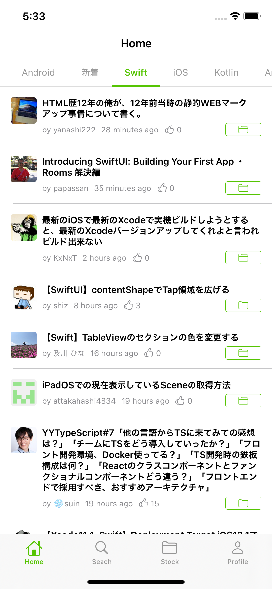
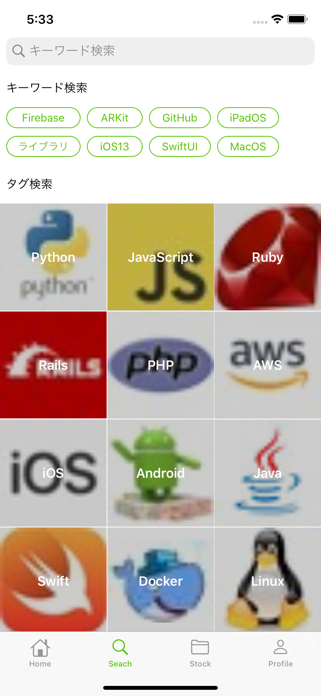
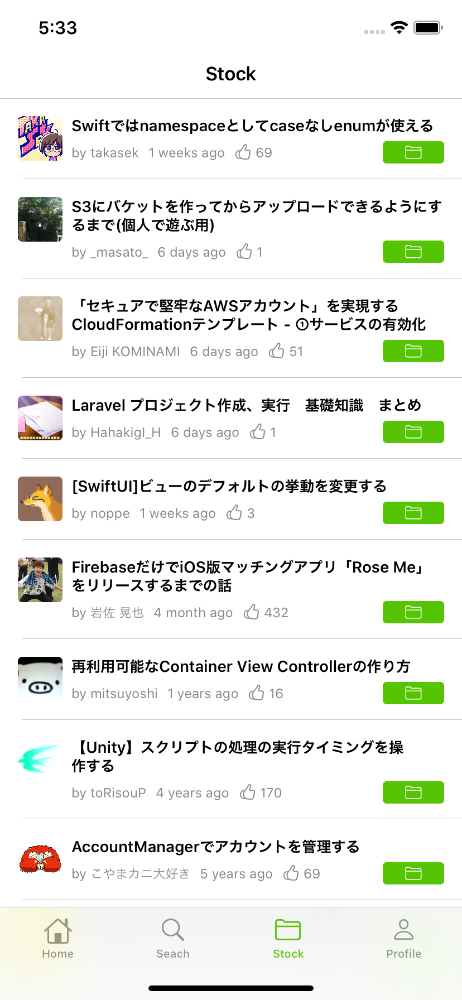
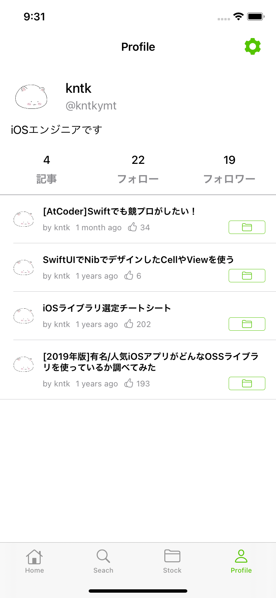
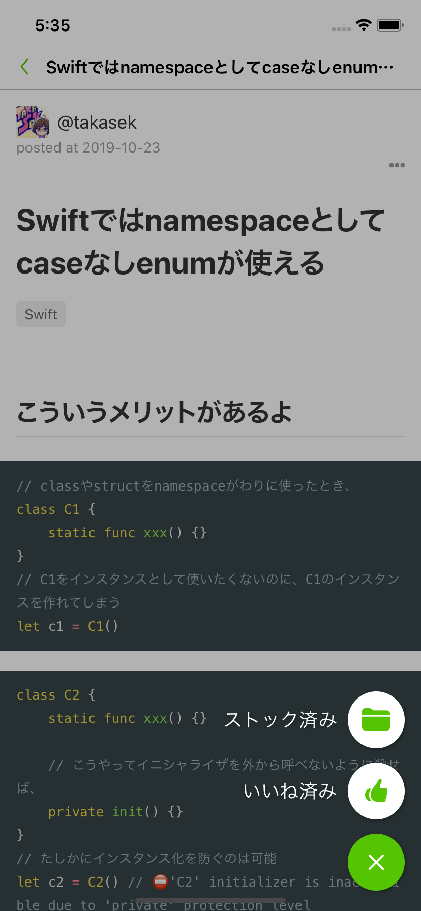

# Qiita app for iOS
## Requirements
- Xcode12.0
- iOS13.0

## Overview
- [Qiita](https://qiita.com/)の記事閲覧アプリ

|  |  |  |  |  |
| ------ | ------ | ------ | ------ | ------ |
|  |  |  |  |  |

## Setup

本アプリはQiitaアプリケーションのクライアントID, クライアントシークレットを利用します。

1. Qiitaウェブサイトの[アプリケーション設定ページ](https://qiita.com/settings/applications)からクライアントID, クライアントシークレットを取得してください。
1. `Configration/.env.sample`を参考に`Configration/.env`を作成し、1. で取得したクライアントID, クライアントシークレットを設定してください。

以上でセットアップは完了です。

## License
MIT 
